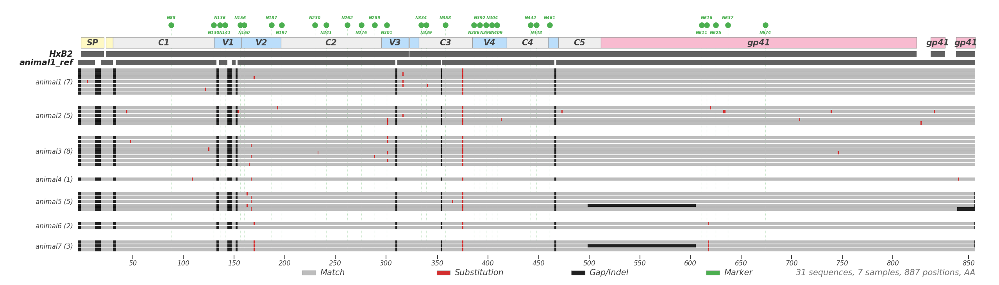

# tpixel

Pixel-block alignment viewer for hundreds of sequences. Renders Roark-style PIXEL plots: grey=match, red=substitution, black=gap.

## Install

```bash
pip install -e .
```

## Usage

```bash
tpixel --fasta examples/env_protein_aligned.fasta -o examples/test_hiv_pixel.png
```

HIV mode is auto-detected when the alignment contains HxB2 and a `*_ref` sequence. Force with `--hiv` or `--no-hiv`.

## Example

Test alignment: `env_protein_aligned.fasta` — 33 sequences (HxB2, animal1_ref, and 31 sample sequences from 7 animals) aligned to 887 columns of HIV-1 Env protein.

Sequences:

| Sequence | Type |
|----------|------|
| HxB2 | Coordinate reference |
| animal1_ref | Parental lineage reference |
| animal1_s1 .. s7 | animal1 samples (7) |
| animal2_s1 .. s5 | animal2 samples (5) |
| animal3_s1 .. s8 | animal3 samples (8) |
| animal4_s1 | animal4 sample (1) |
| animal5_s1 .. s5 | animal5 samples (5) |
| animal6_s1 .. s2 | animal6 samples (2) |
| animal7_s1 .. s3 | animal7 samples (3) |

Output:


